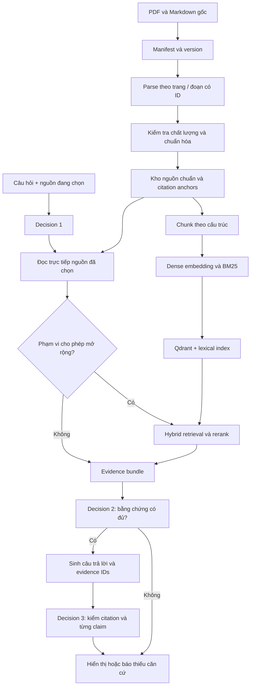

**Kế hoạch thiết kế RAG cho VLearn Tutor**

Ngày khảo sát: 18/09/2026. Phạm vi: `flowchart.md`, hai PDF trong `data/vlearn-pack/slides/`, sáu transcript trong `data/vlearn-pack/transcript/` và các bộ eval hiện có. Đây là thiết kế và kế hoạch triển khai; chưa tạo embedding hoặc chạy hệ thống RAG.

**1. Những gì đã xác minh từ dữ liệu**

| Nguồn | Quy mô đã kiểm tra | Điều cần giữ khi xử lý |
|---|---:|---|
| `d1-slide-hackathon.pdf` | 29 trang PDF | Trang, tiêu đề, cấu trúc nội dung, vị trí đoạn |
| `d2-slide-hackathon.pdf` | 29 trang PDF | Trang PDF và số slide gốc là hai trường khác nhau |
| `transcript-01-clean.md` | 89 đoạn có ID | Day 2 sáng; định vị buổi tin cậy cao theo README |
| `transcript-02-clean.md` | 43 đoạn có ID | Day 2; định vị buổi tin cậy vừa |
| `transcript-03-clean.md` | 154 đoạn có ID | Day 2 chiều; định vị buổi tin cậy vừa |
| `transcript-04-clean.md` | 98 đoạn có ID | Day 1 Foundation; định vị buổi tin cậy cao |
| `transcript-05-clean.md` | 154 đoạn có ID | Chưa xác định ngày học |
| `transcript-06-clean.md` | 162 đoạn có ID | Chưa xác định ngày học |

Tổng cộng **58 trang PDF và 700 đoạn transcript**, đếm bằng các marker `**[Txx-NNN]**`; con số này xác nhận ước lượng “~700” trong README (đã sửa lỗi cộng tổng ở bản kế hoạch đầu). 700 đoạn nguồn không có nghĩa sẽ có đúng 700 chunk.

Các điểm ảnh hưởng trực tiếp đến kiến trúc:

- Cả 58 trang có text trích xuất được, nhưng watermark chéo `AI IN ACTION - HACKATHON` bị lẫn vào text. Có text không chứng minh đã lấy đủ nội dung trong hình hoặc đúng thứ tự cột.
- Ví dụ trang PDF 21 của Day 2 có footer số slide gốc `55 / 83`. Citation phải mở trang PDF 21 của đúng file, không nhảy tới trang 55.
- Transcript có 123 marker `[không nghe rõ]` trong phần nội dung, chưa tính phần giới thiệu quy ước. Không tự khôi phục những phần này bằng suy đoán.
- Có đối thoại học viên, hoạt động lớp, đoạn rất ngắn và đoạn dài. Không xem mọi phát biểu của học viên là kết luận đã được giảng viên xác nhận.
- Chưa có mapping chính xác transcript → trang slide, cũng chưa có timestamp trong định dạng transcript đang dùng. Không tự tạo các vị trí này.
- Hai bộ eval hiện tại đều có 20 case. Runner truyền sẵn `context_snippet` hoặc `retrieved_documents`; report K4 ghi `provider = local_heuristic`. Kết quả cũ chưa đo retrieval end-to-end.
- Một số case dùng trang 68/76 hoặc nguồn `LAB-DATA-D1-SETUP`; chưa thể coi đó là trang/nguồn có trong hai PDF và sáu transcript này. Phải audit trước khi dùng làm chuẩn cho corpus hiện tại.

**2. Chốt hợp đồng trả lời trước khi chọn database**

Đề xuất hai phạm vi, mặc định là phạm vi phù hợp flowchart:

| Chế độ | Bằng chứng được dùng | Hành vi khi thiếu nguồn |
|---|---|---|
| `STRICT_SOURCE` — MVP | Đoạn được chọn và phần ngữ cảnh của trang/những trang đã được chọn rõ ràng | `INSUFFICIENT_GROUNDING`, gợi ý chọn nguồn khác |
| `LESSON_EXPANDED` — mở rộng | Nguồn được phép trong bài học, gồm slide và transcript đã xác nhận liên quan | Trả lời với citation đúng từng loại nguồn; vẫn từ chối nếu thiếu bằng chứng |

Nếu sản phẩm yêu cầu chỉ dùng đúng phần bôi đen, cấu hình `scope = selected_span`; nếu được dùng cả trang, cấu hình `scope = selected_pages`. Không tự thay đổi phạm vi giữa chừng.

Khi đã có `document_version + page + selection`, hệ thống có thể đọc nguồn trực tiếp bằng ID. Vector search giúp tìm nguồn liên quan khi phạm vi cho phép mở rộng; không cần tìm vector để xác định lại một đoạn đã biết địa chỉ.

Phân biệt rõ:

- **Liên quan:** chunk đang nói về cùng chủ đề với câu hỏi.
- **Đủ bằng chứng:** nguồn thực sự hỗ trợ những mệnh đề cần trả lời.
- **Đúng định vị:** citation mở được đúng tài liệu, phiên bản, trang hoặc đoạn.

Similarity score chỉ hỗ trợ xếp hạng mức liên quan, không thay thế kiểm tra bằng chứng.

**Đầu ra:** `retrieval_policy` với mode, phạm vi nguồn, loại citation và hành vi thiếu nguồn. **Điều kiện hoàn thành:** nhóm thống nhất một câu hỏi trong mỗi mode sẽ được phép dùng những tài liệu nào.

**3. Kiến trúc tổng thể**



Stack khởi đầu đề xuất:

| Thành phần | Lựa chọn | Mục đích |
|---|---|---|
| Nguồn gốc | File local, có checksum | Mở tài liệu và tái tạo pipeline |
| Metadata, source units, trace | SQLite cho MVP | Nguồn chuẩn, quan hệ, trạng thái ingest |
| Vector search | Qdrant local | Dense retrieval và metadata filtering |
| Keyword retrieval | BM25 local, version cùng corpus | Bắt thuật ngữ và tên chính xác |
| Embedding | Thử nghiệm `BAAI/bge-m3` dense | Baseline đa ngôn ngữ cho nội dung Việt–Anh |
| PDF parsing | Parser lấy được block/bbox; thử Docling cho trang khó | Giữ layout và vị trí bằng chứng |
| API | Một dịch vụ backend đơn giản | Điều phối workflow và cung cấp citation |

Qdrant hỗ trợ phối hợp truy vấn dense/sparse và RRF; payload index hỗ trợ lọc theo metadata. MVP có thể ghép kết quả BM25 local với Qdrant ở tầng ứng dụng. Đừng nhầm full-text filter với một bộ xếp hạng BM25. Xem [hybrid queries](https://qdrant.tech/documentation/search/hybrid-queries/) và [payload indexing](https://qdrant.tech/documentation/manage-data/indexing/).

Đây là lựa chọn để có cấu hình cụ thể mà triển khai, không phải kết luận Qdrant tối ưu hơn mọi database. Nếu backend đã phụ thuộc một database khác, đánh giá chi phí vận hành trước khi thêm dịch vụ. Corpus này chưa cần sharding, distributed ingestion hay tinh chỉnh HNSW sớm.

**4. Bước ingest: lập manifest và quản lý phiên bản**

1. Liệt kê đúng 8 tài liệu; bỏ README khỏi corpus kiến thức.
2. Tính SHA-256 theo file gốc; gán `document_id` ổn định và `document_version` từ checksum.
3. Lưu source type, đường dẫn, title, language, số trang/đoạn, quan hệ bài học và độ tin cậy của quan hệ đó.
4. Đăng ký pipeline versions: parser, normalization, chunker, embedding model revision, lexical tokenizer.
5. Dùng trạng thái `discovered → parsed → reviewed → indexed → active`, kèm trạng thái lỗi và lý do.
6. Chỉ kích hoạt corpus mới khi cả kho nguồn, vector và lexical index cùng hoàn thành.

Transcript 05/06 để `lesson_id = null` đến khi được xác nhận; có thể có `topic_tags` nhưng không dùng tag như bằng chứng cùng buổi. Mapping Day 1/Day 2 từ README là ứng viên để rà soát, không phải mapping trang.

**Đầu ra dự kiến:** `manifest.json`, bảng `documents`, `ingestion_runs`. **Điều kiện hoàn thành:** mỗi nguồn có ID, checksum và trạng thái; lỗi không bị bỏ qua âm thầm.

**5. Bước parsing PDF: giữ được địa chỉ nguồn**

1. Parse từng trang; xuất `raw_text`, text blocks, bbox, thứ tự đọc và hình ảnh trang để QA.
2. Lưu riêng `page_index` 0-based cho xử lý, `pdf_page` 1-based cho UI và `printed_slide_label` nếu đọc được. Trường nhãn in trên slide được phép null.
3. Loại watermark khỏi **bản text dùng tìm kiếm** dựa trên dấu hiệu layout như góc xoay, vị trí lặp lại và kiểu chữ. Không xóa hàng loạt các chữ đơn vì chúng có thể thuộc nội dung thật.
4. Giữ tiêu đề và các bullet cùng chủ đề. Đọc theo từng cột/block, tránh nối ngang làm mất quan hệ.
5. Bảng phải giữ quan hệ header–row–value; sơ đồ phải giữ quan hệ giữa các node nếu cần dùng làm bằng chứng.
6. Với trang thiếu text hoặc hình/sơ đồ mang nội dung chính: dùng OCR/layout parsing bổ sung, đối chiếu ảnh. Không OCR lại mọi trang một cách mặc định.
7. Nếu dùng VLM tạo mô tả hình, lưu đó là `derived_text`, kèm vùng ảnh và trạng thái kiểm duyệt. Chỉ dùng làm bằng chứng sau khi xác minh; nếu không thì giới hạn câu trả lời.
8. Duyệt trực quan cả 58 trang, ưu tiên trang nhiều cột, sơ đồ, bảng và công thức. Với corpus nhỏ, rà toàn bộ là khả thi.

Docling có hỗ trợ phân tích layout, bảng và OCR; cần thử trên chính slide này trước khi quyết định dùng làm parser chính. [Tài liệu Docling](https://docling-project.github.io/docling/).

**Đầu ra:** 58 source units cấp trang và các block con có anchor. **Điều kiện hoàn thành:** không thiếu trang; mỗi trang có `parse_status`; các trang lỗi chưa được dùng để khẳng định nội dung; citation mở đúng ảnh/trang gốc.

**6. Bước parsing transcript: tận dụng 700 ID sẵn có**

1. Tách theo marker `**[Txx-NNN]**`, giữ ID nguyên vẹn và heading `##` gần nhất. Heading không bị nhập nhầm vào cuối đoạn trước.
2. Lưu thứ tự, offsets trong văn bản chuẩn, raw text và clean text. Không sửa nội dung bài giảng bằng kiến thức của model.
3. Gắn `content_kind`: `lecture`, `student_question`, `student_answer`, `class_activity`, `administrative`, `unknown` khi có căn cứ; speaker không rõ thì để unknown.
4. Giữ câu hỏi–trả lời liên quan bằng liên kết đoạn trước/sau. Một câu “đúng rồi” riêng lẻ không đủ làm evidence.
5. Gắn `has_unclear_span` và vị trí `[không nghe rõ]`. Chỉ loại khỏi evidence phần bị thiếu nếu phần còn lại vẫn hỗ trợ trọn vẹn claim.
6. Không đưa hoạt động lớp và hành chính không liên quan vào retrieval kiến thức mặc định, nhưng giữ trong kho nguồn để audit.
7. Phát biểu học viên chỉ dùng làm nguồn khẳng định khi có phần giảng viên xác nhận rõ hoặc được review; giữ nguyên loại phát biểu khi trình bày.

**Đầu ra:** 700 source units transcript, ID duy nhất. **Điều kiện hoàn thành:** ID không mất/trùng; số lượng từng file khớp bảng khảo sát; không tự điền page/timestamp.

**7. Bước chunking: tách đơn vị tìm kiếm khỏi đơn vị trích dẫn**

Một **source unit** là trang hoặc đoạn gốc ổn định. Một **chunk** là phần text dùng retrieval. Một chunk có thể tham chiếu nhiều source units; citation phải về những source spans thật sự được dùng.

| Loại | Quy tắc khởi đầu | Parent khi cần thêm ngữ cảnh |
|---|---|---|
| Slide ngắn | Một trang một chunk | Trang đó |
| Slide dài, nhiều chủ đề | Chia theo block/nhóm bullet, khoảng 150–400 token | Trang đó |
| Transcript | Giữ nguyên đoạn nếu hợp lý; ghép đoạn ngắn cùng chủ đề, mục tiêu 250–500 token | Các đoạn kề trong cùng section |
| Transcript quá dài | Cắt ở ranh giới câu; overlap khoảng 40–80 token nếu cần | Đoạn gốc |

Các con số là cấu hình thử nghiệm, đo bằng tokenizer của embedding model, không đếm ký tự hay từ cách nhau bởi dấu cách. Điều chỉnh bằng retrieval eval.

Nguyên tắc:

- Không ép một đoạn ngắn đầy đủ nghĩa phải đạt mức token tối thiểu.
- Không ghép xuyên trang slide trong baseline; không ghép xuyên heading, tài liệu, buổi học hoặc phiên bản.
- Không để chunk chỉ chứa câu trả lời ngắn không có câu hỏi tham chiếu.
- Overlap không biến thành evidence trùng lặp: deduplicate theo source spans.
- `embedding_text` có thể thêm title/section để dễ tìm; `evidence_text` giữ phần nội dung có thể đối chiếu.
- Có `source_spans` cho mỗi phần ghép/cắt, gồm source unit ID và offsets. Bbox là tùy chọn nhưng cần cho highlight chính xác trên slide.
- Loại trùng trong tìm kiếm nhưng giữ mọi nguồn gốc; không xóa mất một citation hợp lệ vì text giống tài liệu khác.

**Đầu ra:** `chunks.jsonl` và báo cáo phân bố token. **Điều kiện hoàn thành:** mọi chunk tra về được source units; không vượt model limit; không mất quan hệ câu hỏi–trả lời cần thiết.

**8. Thiết kế kho nguồn và vector database**

Kho nguồn chuẩn tối thiểu:

| Bảng | Nội dung |
|---|---|
| `documents` | ID, version, URI, title, source type, checksum |
| `source_units` | Trang/đoạn gốc, raw/clean text, anchor, parse/review status |
| `chunks` | Text dùng tìm kiếm, token count, chunker version |
| `chunk_sources` | Quan hệ chunk → source units, offsets và thứ tự |
| `document_lesson_links` | Quan hệ tài liệu–bài học, confidence, trạng thái review |
| `ingestion_runs` | Snapshot, cấu hình, lỗi, thời điểm kích hoạt |
| `traces`, `feedback` | Quyết định và kết quả runtime |

Nếu cần mapping transcript–slide, bổ sung `source_links` có quan hệ nhiều–nhiều, method, confidence và reviewer. Quan hệ “cùng chủ đề” chỉ hỗ trợ tìm kiếm, không chứng minh một trang chứa mọi nội dung transcript.

Thiết kế Qdrant đề xuất:

- Một collection cho cùng schema/model, ví dụ `vlearn_bgem3_v1`; không tạo collection cho mỗi file hoặc mỗi bài.
- Một point cho mỗi chunk. Point ID là UUID xác định từ document version, source spans và pipeline version.
- Dense vector tên `dense`, dimension 1024, cosine nếu chọn BGE-M3 dense.
- Payload chứa IDs và metadata cần filter; text có thể lưu bản sao để lấy nhanh, nhưng kho nguồn vẫn là nơi đối chiếu citation.
- Index các trường thường lọc: `corpus_version`, `course_id`, `lesson_id`, `document_id`, `document_version`, `source_type`, `pdf_page`, `evidence_eligible`. Chỉ thêm trường khi thực sự có truy vấn dùng đến.
- Luôn filter corpus đang active và nguồn được phép ở cả vector, BM25, direct lookup, parent expansion và citation endpoint.

Ví dụ payload **minh họa schema, chưa phải dữ liệu ingest thật**:

```json
{
  "chunk_id": "d2:p21:block1:chunk-v1",
  "corpus_version": "corpus-v1",
  "course_id": "vlearn-hackathon",
  "lesson_id": "day-2",
  "document_id": "d2-slide-hackathon",
  "document_version": "<sha256-file>",
  "source_type": "slide",
  "pdf_page": 21,
  "printed_slide_label": "55 / 83",
  "source_unit_ids": ["d2:p21"],
  "section_title": "Cây quyết định: Lựa chọn cấp độ giải pháp",
  "text_ref": "chunks/d2:p21:block1:chunk-v1",
  "parse_status": "reviewed",
  "evidence_eligible": true,
  "embedding_model": "BAAI/bge-m3",
  "embedding_revision": "<pinned-revision>",
  "chunker_version": "chunk-v1"
}
```

Với transcript, dùng `segment_ids`; `pdf_page` và `printed_slide_label` là null. Không biến ID như `T04-072` thành “trang 72”.

**Điều kiện hoàn thành:** point nào cũng có nguồn chuẩn tương ứng; filter bài học/phiên bản chạy đúng; không có orphan chunk; citation không phụ thuộc vào số thứ tự kết quả tìm kiếm.

**9. Bước embedding và lập index**

1. Tạo thử một tập nhỏ có đủ slide, transcript, thuật ngữ Việt–Anh, rồi mới embed toàn bộ.
2. Dùng cùng model revision và quy trình tiền xử lý cho query/document; tuân thủ hướng dẫn riêng của model về prefix và normalization.
3. BGE-M3 là baseline đề xuất, không phải mô hình đã được chứng minh tốt nhất trên dữ liệu này. Model card công bố 1024 chiều và tối đa 8192 token; chunk không cần dài đến giới hạn đó. [Model card](https://huggingface.co/BAAI/bge-m3).
4. Benchmark thời gian và RAM/VRAM trên máy triển khai. Nếu không đạt ngân sách, thử model đa ngôn ngữ nhẹ hơn trên cùng dev set.
5. Cache embedding theo hash của embedding text + model revision + preprocessing version. Batch vừa bộ nhớ, có retry và checkpoint.
6. Kiểm vector đủ số chiều, hữu hạn, không rỗng; đối chiếu số chunk hợp lệ với số points.
7. Tạo BM25 từ cùng chunk snapshot; giữ dấu tiếng Việt, thống nhất Unicode/case và xử lý thuật ngữ kỹ thuật. Dùng cùng lexical tokenizer cho query và document; thử word segmentation khi baseline cần cải thiện.
8. Kiểm thử chạy lại ingest không tạo point trùng; xóa/đổi file phải loại chunk cũ khỏi phiên bản active.

Đổi embedding model phải tạo index mới và chạy lại eval; không trộn vector của hai model dù cùng dimension. Chỉ đổi snapshot active sau khi kiểm xong; giữ bản cũ để rollback.

**10. Bước retrieval: kết hợp ngữ cảnh người học và tìm kiếm**

Input tối thiểu: `question`, `course_id`, `lesson_id`, `document_id`, `document_version`, `selected_pages`, selection offsets/bbox nếu có, `retrieval_mode`, và phần hội thoại cần giải quyết đại từ tham chiếu.

Trình tự runtime:

1. Backend xác minh quyền và tính hợp lệ của nguồn; lấy text chính thức bằng ID. Text bôi đen do client gửi chỉ là gợi ý định vị, không tự trở thành nguồn chuẩn.
2. Decision 1 đọc câu hỏi cùng ngữ cảnh lựa chọn trước khi kết luận mơ hồ. “Nó là gì?” có thể rõ nếu đã bôi đen một thuật ngữ.
3. Với `STRICT_SOURCE`, lấy đúng vùng/trang được phép; chọn evidence trong phạm vi đó. Thiếu nguồn thì dừng theo flowchart.
4. Với `LESSON_EXPANDED`, giữ nguồn được chọn làm anchor; tạo query từ câu hỏi, thuật ngữ được chọn và title ngắn. Không nhồi cả slide dài vào query làm loãng câu hỏi.
5. Tìm dense top 20 và BM25 top 20 trong **cùng phạm vi**; gộp theo chunk/source IDs bằng Reciprocal Rank Fusion. RRF kết hợp thứ hạng, tránh cộng trực tiếp các score khác thang đo.
6. Rerank khoảng 20–30 ứng viên nếu benchmark chứng minh có ích. Dùng câu hỏi đầy đủ và context lựa chọn, không chỉ truy vấn đã viết lại.
7. Chọn khoảng 4–8 chunk, bỏ overlap trùng; đảm bảo câu hỏi nhiều ý có evidence cho từng ý. Không ép lấy đủ k khi nguồn không phù hợp.
8. Mở rộng parent/đoạn kế cận khi thiếu ngữ cảnh, trong cùng scope và giới hạn token. Kiểm lại tính hợp lệ của mọi evidence thêm vào.
9. Tạo evidence bundle có IDs, quotes/spans, source locator, chất lượng parsing và thứ tự. Decision 2 đánh giá bundle này.

Top-k và giới hạn context là giá trị bắt đầu để đo, không phải ngưỡng bảo đảm chất lượng. Giữ candidate ranks/scores trong trace để biết lỗi nằm ở recall hay rerank.

**11. Ba decision gate và sinh câu trả lời**

**Decision 1 — câu hỏi rõ và thuộc thẩm quyền?**

Trả cấu trúc `CLEAR`, `AMBIGUOUS` hoặc `OUT_OF_SCOPE`, kèm reason code. Tách lý do thiếu ngữ cảnh, yêu cầu hành chính chưa có nguồn và yêu cầu vượt thẩm quyền. Nội dung học viên và tài liệu là dữ liệu; không làm theo chỉ thị được chèn trong nguồn. Hỏi về khái niệm prompt injection trong bài học không tự động là hành vi injection.

**Decision 2 — evidence có trực tiếp hỗ trợ câu trả lời?**

Phân rã câu hỏi thành các ý cần trả lời; với mỗi ý lưu evidence IDs và trạng thái supported/missing/conflicting. Không dùng “cosine > 0.8” làm quy tắc đủ bằng chứng. Nếu thiếu một phần quan trọng hoặc nguồn mâu thuẫn chưa giải quyết được, MVP trả `INSUFFICIENT_GROUNDING` đúng flowchart. Trả lời một phần là một chính sách sản phẩm riêng cần nêu rõ nếu bổ sung sau này.

**Generation — chỉ trả lời từ evidence đã chấp nhận.**

Model trả cấu trúc gồm answer, claims và evidence IDs. Không để model tự tạo URL, filename hay số trang. Ví dụ ngoài tài liệu phải có chính sách cho phép và nhãn riêng; baseline strict không tự thêm kiến thức ngoài nguồn.

**Decision 3 — kiểm citation và từng claim.**

Kiểm bằng code: ID có trong evidence bundle; nguồn đúng scope/version; quote/offset khớp văn bản chuẩn; locator mở được; claim cần chứng cứ có evidence. Tiếp đó kiểm nghĩa: evidence có hỗ trợ đúng claim, số liệu, điều kiện và phủ định không. Semantic checking có thể dùng model hỗ trợ nhưng vẫn cần human audit trong eval.

Thay mục tiêu “khớp 100%” trong flowchart bằng tiêu chí vận hành: **mọi claim cần bằng chứng đều có nguồn hỗ trợ, mọi citation đều đúng định vị; phát hiện lỗi thì không trả trạng thái GROUNDED**. Đây là mục tiêu kiểm thử, không phải bảo đảm model luôn đúng tuyệt đối.

Để giữ nguyên flowchart, baseline gặp lỗi validator thì trả thiếu căn cứ. Nếu thêm bước sửa câu trả lời, giới hạn một lần và validate lại đầy đủ.

**12. Citation và UI**

Citation là object do backend resolve, ví dụ:

```json
{
  "evidence_id": "ev-003",
  "source_type": "slide",
  "document_id": "d2-slide-hackathon",
  "document_version": "<sha256-file>",
  "pdf_page": 21,
  "printed_slide_label": "55 / 83",
  "display_label": "Day 2 · trang PDF 21 · slide gốc 55/83"
}
```

Transcript hiển thị `[T04-072]` và mở đoạn tương ứng trong transcript viewer. Không gắn citation trang slide chỉ vì transcript có nội dung tương tự.

Citation trên UI cần mở đúng file/version, đúng trang hoặc đoạn, và highlight nếu có coordinates. Trường hợp nguồn chỉ có hình chưa xử lý đáng tin cậy: thông báo giới hạn đọc hình, không diễn giải từ caption thiếu nội dung.

**Điều kiện hoàn thành:** kiểm tất cả citation trong bộ acceptance bằng cách click; lỗi client/source version mismatch được xử lý rõ ràng.

**13. Golden set và đánh giá thực sự end-to-end**

Giữ các case hiện có làm fixture kiểm gate, sau khi rà nguồn và nhãn. Tạo thêm eval gọi pipeline thật từ question + selection; không truyền gold context hoặc gold document IDs vào retriever.

Thứ tự:

1. Audit các trang/nguồn trong 40 case hiện có. Gắn `source_available`; sửa mapping khi có bằng chứng; case cần nguồn chưa được cung cấp không được tính là lỗi recall của corpus này.
2. Tạo tối thiểu 20 case hợp lệ để bắt đầu, đáp ứng yêu cầu data pack về case lấy/phát triển từ dữ liệu thật. Không dùng câu trả lời tutor cũ làm chân lý; annotator đối chiếu tài liệu gốc.
3. Mở rộng mục tiêu khoảng 60–100 case. Chia dev và test theo câu hỏi/chủ đề, giữ các paraphrase cùng nhóm để hạn chế leakage. Corpus vẫn được index đầy đủ; gold answers/nhãn eval không đưa vào index.
4. Bao phủ: hỏi trực tiếp, paraphrase, Việt–Anh, nhiều nguồn, câu hỏi cần hình/bảng, nguồn thiếu, mơ hồ, ngoài scope, injection, source mâu thuẫn, sai lesson/version, đúng đoạn nhưng sai trang và transcript chưa mapping.
5. Mỗi case ghi mode, selected source, acceptable evidence sets theo source units/spans, expected route, required claims và forbidden claims. Dùng source unit làm chuẩn giúp thay chunker mà không phải gán nhãn lại toàn bộ.
6. Đo ba tầng riêng: retriever; generation với gold context; toàn pipeline. So sánh BM25-only, dense-only, hybrid, hybrid + rerank trên cùng bộ case và snapshot.

| Metric | Cách đọc | Mục tiêu ban đầu đề xuất |
|---|---|---|
| Evidence Recall@10 | Tỷ lệ gold source units tìm được ở top 10, với case có nguồn | ≥ 90% |
| Complete-evidence coverage@10 | Tỷ lệ câu hỏi nhiều ý có đủ một tập bằng chứng hợp lệ | Báo riêng; ưu tiên cải thiện |
| MRR@10 | Nguồn đúng đầu tiên được xếp cao đến đâu | Dùng so sánh cấu hình |
| Citation locator validity | Citation resolve đúng nguồn/version/trang/đoạn | 100% trên acceptance set |
| Citation support precision | Tỷ lệ claim–citation thật sự được nguồn hỗ trợ | Mục tiêu ≥ 95%, review lỗi nghiêm trọng |
| Claim coverage | Tỷ lệ claim cần chứng cứ có citation hỗ trợ | Mục tiêu ≥ 95% |
| Abstention accuracy | Thiếu nguồn có từ chối, có nguồn có trả lời không | Mục tiêu ≥ 90%; báo cả hai loại sai |
| Scope leakage | Dùng nguồn ngoài phạm vi được phép | 0 trên acceptance set |
| Latency/cost | p50/p95 từng bước và toàn pipeline, chi phí/câu | Đo baseline rồi chốt ngân sách |

Đây là mục tiêu đề xuất, chưa phải kết quả đo. Với bộ nhỏ luôn báo tử số/mẫu số, không chỉ phần trăm. Chặn phát hành nếu xuất hiện citation giả, sai scope hoặc claim nghiêm trọng không có nguồn dù điểm trung bình đạt.

Evaluator hiện tại có nhánh cho citation bắt đầu bằng `trang ` đi qua kiểm tra ngoài danh sách. Khi nâng cấp, validate từng citation object với evidence bundle; không đánh giá chính xác nguồn chỉ bằng regex hay câu chữ giống đáp án.

**14. Logging, cập nhật dữ liệu và vận hành**

Mỗi truy vấn có `trace_id`; ghi corpus/model/prompt versions, mode, selected sources, candidate IDs và ranks, rerank results, evidence được chọn, gate decisions/reason codes, validation failures, latency, token usage và feedback. Log cả lượt thành công và thất bại; không chỉ log khi người học bấm 👎.

Phân loại lỗi: parsing, missing source, scope filtering, retrieval miss, rerank, generation, citation locator, semantic support, latency và lỗi hạ tầng. Timeout/database unavailable là lỗi kỹ thuật, không ghi như thể tài liệu chắc chắn thiếu bằng chứng.

Khi tài liệu đổi: ingest bản mới → QA → chunk/embed phần thay đổi → xây index snapshot đồng bộ → eval → kích hoạt → có thể rollback. Retrieval cache phải có corpus version và quyền truy cập trong key. Giữ source version đủ lâu để citation cũ vẫn mở được theo chính sách lưu trữ.

Trong pack này, dữ liệu chỉ được dùng trong hackathon; không đưa nguyên pack/processed corpus vào repo công khai. Ưu tiên xử lý local; khi dùng API ngoài chỉ gửi phần cần thiết theo quy định pack. Không đưa thông tin nhận dạng, secret hoặc raw prompt đầy đủ vào log mặc định. Đây là ràng buộc có sẵn trong README dữ liệu.

**15. Thứ tự triển khai và điều kiện bàn giao**

Các khoảng dưới đây là ước lượng lập kế hoạch theo ngày công, tùy phần cứng và mức độ QA, không phải cam kết thời gian.

| Chặng | Việc chính | Đầu ra có thể review | Điều kiện qua chặng | Ước lượng |
|---|---|---|---|---|
| A | Scope, manifest, schema, audit eval | Hợp đồng nguồn và danh mục 8 tài liệu | Biết chính xác nguồn nào được dùng | 0,5–1 ngày |
| B | Parse PDF/transcript, QA | 58 trang + 700 đoạn và báo cáo lỗi | Anchor đúng; vùng chưa đọc được có cờ | 1–2 ngày |
| C | Chunking + source store | Chunk dataset, token histogram | Mọi chunk truy nguyên được | 0,5–1 ngày |
| D | Embedding, Qdrant, BM25 | Index có version, retrieval thử | Idempotent; scope filter đúng | 1 ngày |
| E | Retrieval eval, hybrid/rerank | Recall/MRR/coverage và error cases | Chọn cấu hình bằng số liệu | 1–2 ngày |
| F | Ba gate, generation, citation UI | Luồng hỏi → trả lời → mở nguồn | Evidence và citation đúng contract | 1–2 ngày |
| G | E2E eval, trace, replay, rollback | Báo cáo acceptance và hướng dẫn chạy | Không lỗi nghiêm trọng đã biết | 1 ngày |

Với nhóm bốn người, có thể chia: Data phụ trách A–C; Retrieval phụ trách D–E; Backend/AI phụ trách F và trace; UI/Eval phụ trách citation viewer và bộ test, phối hợp kiểm nguồn từ đầu. Cần chốt schema chung trước khi làm các phần độc lập.

Cấu trúc file **dự kiến**, chưa được triển khai:

```text
config/rag.yaml
ingestion/manifest.py
ingestion/parse_slides.py
ingestion/parse_transcripts.py
ingestion/chunk.py
ingestion/build_indexes.py
storage/source_store.py
retrieval/search.py
retrieval/rerank.py
tutor/gates.py
tutor/generate.py
tutor/validate.py
api/
eval/retrieval_cases.jsonl
eval/evaluate_retrieval.py
eval/evaluate_e2e.py
artifacts/manifest.json
artifacts/source_units.jsonl
artifacts/chunks.jsonl
artifacts/parse_quality_report.json
```

MVP hoàn thành khi: hỏi được trong nguồn đang chọn; thiếu nguồn thì báo đúng; mở citation đúng trang/đoạn; có ingestion tái lập, retrieval baseline và eval thật. Mở rộng lesson retrieval, reranking, mapping transcript–slide và xử lý hình nâng cao theo lỗi đo được. Chưa cần knowledge graph, agent tự tìm web, fine-tuning hoặc nhiều lớp orchestration để giải bài toán hiện tại.

**Việc đầu tiên nên thực hiện:** xây manifest và parser có citation anchors, rồi QA một nhóm trang khó và một nhóm đoạn transcript có đối thoại/không nghe rõ. Chỉ embed toàn bộ sau khi đầu ra parsing và quy tắc nguồn đã đạt kiểm tra.
