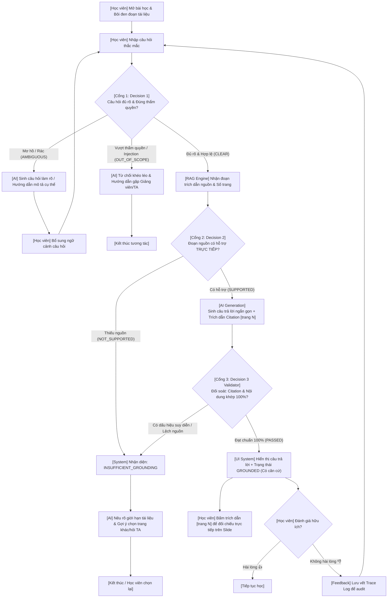

# 📘 VLearn AI Tutor — Codebase Architecture & Technical Documentation

> **Track A: VLearn Tutor (AI Thực Chiến K4)**  
> **Dự án:** Trợ lý học tập AI có căn cứ với kiến trúc RAG 3 cổng kiểm soát (Tri-Gate Grounded RAG)  
> **Đội thi:** K4-3B-E403-Số 1  

---

## 📑 Mục lục
1. [Tổng quan dự án & Bài toán giải quyết](#1-tổng-quan-dự-án--bài-toán-giải-quyết)
2. [Kiến trúc RAG 3 Cổng Quyết định (Tri-Gate Architecture)](#2-kiến-trúc-rag-3-cổng-quyết-định-tri-gate-architecture)
3. [Cấu trúc thư mục Codebase](#3-cấu-trúc-thư-mục-codebase)
4. [Chi tiết các Module chính](#4-chi-tiết-các-module-chính)
   - [4.1. `core_decision.py` — Não bộ AI & State Machine](#41-core_decisionpy--não-bộ-ai--state-machine)
   - [4.2. `logger.py` — Trace Logger & Kiểm toán hệ thống](#42-loggerpy--trace-logger--kiểm-toán-hệ-thống)
   - [4.3. `web_server.py` — API Server & Tích hợp](#43-web_serverpy--api-server--tích-hợp)
   - [4.4. `demo_cli.py` — Kịch bản kiểm thử dòng lệnh](#44-demo_clipy--kịch-bản-kiểm-thử-dòng-lệnh)
   - [4.5. `static/` — Giao diện Web Interactive VLearn](#45-static--giao-diện-web-interactive-vlearn)
5. [Cơ chế Multi-Provider & Local Heuristic Fallback](#5-cơ-chế-multi-provider--local-heuristic-fallback)
6. [Ma trận 4 Lớp Chỗ Khó (Error Taxonomy)](#6-ma-trận-4-lớp-chỗ-khó-error-taxonomy)
7. [Hướng dẫn cài đặt & Chạy ứng dụng](#7-hướng-dẫn-cài-đặt--chạy-ứng-dụng)
8. [Tích hợp Đánh giá (Eval & Golden Set)](#8-tích-hợp-đánh-giá-eval--golden-set)

---

## 1. Tổng quan dự án & Bài toán giải quyết

### 1.1. Bối cảnh
Trong nền tảng học tập VLearn, học viên thường xuyên vừa đọc tài liệu / slide vừa đặt câu hỏi cho AI Tutor. Tuy nhiên, các hệ thống chatbot RAG ngây thơ (Naive RAG) hiện nay gặp 3 vấn đề chí mạng:
1. **Ảo giác (Hallucination):** Khi tài liệu nguồn không chứa câu trả lời, AI tự ý suy diễn hoặc bịa đặt tri thức ngoài phạm vi bài học.
2. **Không phân biệt mơ hồ & vượt thẩm quyền:** Khi học viên bôi đen ký tự rác (`asds`, `hả`), hoặc hỏi về quy chế/deadline/cộng điểm (vượt thẩm quyền AI), AI vẫn cố trả lời bừa bãi.
3. **Thiếu trích dẫn kiểm chứng:** Câu trả lời không kèm số trang hoặc vị trí nguồn cụ thể, khiến người học mất niềm tin.

### 1.2. Lát cắt sản phẩm (One-sentence Product Slice)
> **Một học viên** bôi đen đoạn tài liệu trên slide VLearn và đặt câu hỏi $\rightarrow$ **AI Tutor** qua 3 cổng quyết định kiểm tra tính rõ ràng, thẩm định trực tiếp nguồn trích xuất, sinh câu trả lời ngắn kèm trích dẫn `[trang N]`, và đối soát chống bịa đặt 100% $\rightarrow$ **Học viên** nhận câu trả lời có căn cứ minh bạch hoặc chỉ dẫn phù hợp.

---

## 2. Kiến trúc RAG 3 Cổng Quyết định (Tri-Gate Architecture)

Hệ thống được thiết kế theo mô hình **Stateful Guarded RAG**, không chỉ đơn thuần là `Retrieve -> Augment -> Generate`, mà có các lớp kiểm soát (Guardrails) ở từng bước:



---

## 3. Cấu trúc thư mục Codebase

```
codebase/
├── __init__.py                 # Đánh dấu package Python
├── core_decision.py            # Não bộ AI: 3 Cổng quyết định, gọi LLM, Fallback Heuristic
├── logger.py                   # Bộ ghi vết TraceLogger (ISO-8601, raw prompt, raw response)
├── web_server.py               # HTTP REST API Server (port 8080) & Slide Data Provider
├── demo_cli.py                 # Kịch bản Terminal chạy 4 luồng Happy Path / Edge Cases
├── static/                     # Giao diện Web Interactive VLearn Tutor (React 18 + Tailwind)
│   ├── index.html              # HTML Shell với CDN React, Tailwind, Fonts
│   ├── app.jsx                 # Toàn bộ ứng dụng React Frontend (Slide viewer + Chat + Trace Log)
│   ├── app.js                  # Bản bundle JavaScript tương thích trình duyệt
│   └── style.css               # Tùy chỉnh hiệu ứng thanh cuộn, animation glow
└── README.md                   # Tài liệu kỹ thuật chi tiết của codebase (file này)
```

---

## 4. Chi tiết các Module chính

### 4.1. `core_decision.py` — Não bộ AI & State Machine
Đây là module cốt lõi của toàn bộ giải pháp RAG, đảm nhiệm việc điều phối logic và quyết định:

* **Lớp `VLearnTutorCore`:**
  * Khởi tạo với cấu hình model (`gemini-2.5-flash`, `gpt-4o-mini`, hoặc fallback cục bộ).
  * Hàm `_call_llm(system_prompt, user_prompt, step_name, metadata)`:
    * Gọi API tới nhà cung cấp mô hình.
    * Tự động đo thời gian phản hồi (`latency_ms`).
    * **Bắt buộc ghi vết** qua `logger.log()` để phục vụ audit.
  * Hàm `execute_workflow(student_question, context_snippet, page_ref, turn_id)`:
    * **Cổng 1 (Bước C):** Kiểm tra câu hỏi (`DECISION_1_AMBIGUITY`). Trả về JSON `{decision: CLEAR | AMBIGUOUS | OUT_OF_SCOPE}`.
    * **Cổng 2 (Bước G):** Thẩm định nguồn (`DECISION_2_SUPPORT_CHECK`). Trả về JSON `{decision: SUPPORTED | NOT_SUPPORTED}`. CẤM SUY ĐOÁN NGOÀI NGUỒN.
    * **Sinh phản hồi (Bước J):** Prompt ràng buộc cực mạnh (`GENERATION_WITH_CITATION`), bắt buộc kèm trích dẫn `[trang N]`.
    * **Cổng 3 (Bước K):** Thẩm định độc lập (`DECISION_3_VALIDATOR`). So sánh câu sinh ra với ngữ cảnh gốc, phát hiện ảo giác (`has_hallucination`).
* **Hàm tiện ích `parse_student_question_turn(raw_turn_text)`:**
  * Phân tích cú pháp dạng log thực tế của VLearn:  
    `(Trang N, đoạn được chọn: "...") <nội dung câu hỏi>`  
    để bóc tách số trang, đoạn bôi đen và câu hỏi học viên.

### 4.2. `logger.py` — Trace Logger & Kiểm toán hệ thống
Đáp ứng yêu cầu khắt khe của quy chế Hackathon về tính minh bạch của các lời gọi AI:
* Lưu toàn bộ các lượt gọi mô hình vào `eval/trace_log.json`.
* Mỗi bản ghi chứa đủ:
  * `timestamp`: Thời gian theo chuẩn ISO-8601 (UTC).
  * `raw_prompt`: Toàn bộ system instruction và user prompt gửi lên model.
  * `raw_response`: Nội dung text thô không qua chỉnh sửa do model trả về.
  * `step_name`: Tên bước logic (`DECISION_1_AMBIGUITY`, `DECISION_2_SUPPORT_CHECK`, `GENERATION_WITH_CITATION`, `DECISION_3_VALIDATOR`).
  * `model`: Nhà cung cấp & tên model (ví dụ `gemini:gemini-2.5-flash`).
  * `latency_ms`: Độ trễ tính bằng mili-giây.
  * `metadata`: Chứa ID phiên hỏi (`turn_id`).

### 4.3. `web_server.py` — API Server & Tích hợp
Server backend dựng bằng thư viện chuẩn của Python (`http.server`, `socketserver`), hoàn toàn không phụ thuộc vào framework nặng như Flask hay FastAPI:
* **Endpoints cung cấp:**
  * `GET /`: Phục vụ ứng dụng web từ `codebase/static/index.html`.
  * `GET /api/slides`: Trả về danh mục slide bài giảng mẫu (15 slide cốt lõi từ Trang 1 đến Trang 76).
  * `GET /api/golden_set`: Trả về danh sách 20 Golden Cases để kiểm thử trực quan trên giao diện.
  * `GET /api/traces`: Trả về các bản ghi trace log gần nhất để giám khảo đối soát trực tiếp trên UI.
  * `POST /api/chat`: Tiếp nhận câu hỏi, đoạn bôi đen, trang tài liệu; kích hoạt `VLearnTutorCore.execute_workflow()` và trả về kết quả kèm trace log mới nhất.

### 4.4. `demo_cli.py` — Kịch bản kiểm thử dòng lệnh
Công cụ chạy nhanh không cần mở trình duyệt, minh họa 4 kịch bản đại diện:
1. **Happy Path:** Câu hỏi chuẩn xác, có dữ liệu trong bài giảng $\rightarrow$ sinh phản hồi có citation `[trang 21]`.
2. **Mơ hồ (Ambiguous):** Đoạn bôi đen rác `asds` $\rightarrow$ AI nhận diện và yêu cầu làm rõ.
3. **Vượt thẩm quyền (Out of scope):** Học viên xin lùi hạn nộp bài $\rightarrow$ AI từ chối khéo và hướng dẫn gặp TA/Giảng viên.
4. **Thiếu nguồn (Insufficient grounding):** Hỏi nội dung không có trên trang tài liệu $\rightarrow$ AI thành thật báo thiếu căn cứ thay vì bịa đặt.

### 4.5. `static/` — Giao diện Web Interactive VLearn
Giao diện người dùng mô phỏng chân thực trải nghiệm học tập trên VLearn:
* **Màn hình đôi (Split View):**
  * **Bên trái — Slide Reader:** Hiển thị slide bài giảng, cho phép học viên bôi đen trực tiếp văn bản trên slide hoặc chọn câu hỏi mẫu.
  * **Bên phải — AI Tutor Assistant Drawer:** Hộp thoại hỏi đáp với chỉ báo trạng thái trực quan:
    * 🟢 `GROUNDED (Có căn cứ)`: Đi kèm badge số trang có thể click để nhảy đến vị trí nguồn.
    * 🟡 `CLARIFICATION (Cần làm rõ)`: Đưa gợi ý định hướng học viên.
    * 🔴 `OUT OF SCOPE / INSUFFICIENT GROUNDING`: Minh bạch giới hạn của AI.
* **Inspect Pipeline & Live Trace Log:**
  * Nút "Xem luồng quyết định (Pipeline Trace)": Xem chi tiết kết quả JSON của từng Cổng 1, Cổng 2, Cổng 3.
  * Tab "Kiểm toán Trace Log": Đọc trực tiếp raw prompt và raw response trong file `eval/trace_log.json`.

---

## 5. Cơ chế Multi-Provider & Local Heuristic Fallback

Hệ thống hỗ trợ linh hoạt 3 chế độ hoạt động:

| Chế độ | Điều kiện kích hoạt | Đặc điểm |
|---|---|---|
| **Google Gemini** | Có biến `GEMINI_API_KEY` trong `.env` | Sử dụng SDK `google-genai` mới nhất (hoặc fallback `google.generativeai`), model `gemini-2.5-flash`. |
| **OpenAI** | Có biến `OPENAI_API_KEY` trong `.env` | Sử dụng `openai` client, model `gpt-4o-mini`. |
| **Local Heuristic** | Không có API Key trong môi trường | Bộ suy luận cục bộ bằng thuật toán Rule-based & Token Overlap, đảm bảo test luồng và chạy eval 100% mượt mà offline. |

> **Ưu điểm thiết kế:** Dự án không bị đình trệ khi mất mạng, hết quota API, hay khi chạy chấm điểm tự động trong môi trường sandbox khép kín.

---

## 6. Ma trận 4 Lớp Chỗ Khó (Error Taxonomy)

Hệ thống được thiết kế bám sát 4 lớp lỗi điển hình theo rubric AI Product:

| Lớp lỗi | Vấn đề thực tế từ Chatlog | Cách hệ thống xử lý trong Codebase | Vị trí kiểm soát |
|---|---|---|---|
| **① Nguồn sự thật** | Tài liệu không nói nhưng AI bịa ra câu trả lời | Cổng 2 thẩm định nguồn; nếu thiếu $\rightarrow$ trả về `INSUFFICIENT_GROUNDING`. Cổng 3 quét đối soát chống hallucination. | `DECISION_2`, `DECISION_3` |
| **② Mơ hồ / Thiếu tin** | Học viên bôi đen linh tinh (`asds`, `...`) hoặc câu hỏi cộc lốc | Cổng 1 nhận diện độ dài, ngữ cảnh; chủ động hỏi lại thay vì đoán mò. | `DECISION_1` |
| **③ Ngoài thẩm quyền** | Học viên xin lùi hạn deadline, hỏi điểm danh, xin đáp án quiz | Cổng 1 nhận diện từ khóa quy chế; từ chối chuẩn mực và hướng dẫn liên hệ TA/kênh Discord. | `DECISION_1` |
| **④ Prompt Injection** | Yêu cầu "Bỏ qua các lệnh trước", "Đọc API key" | Cổng 1 phát hiện pattern tấn công; từ chối và khoanh vùng an toàn. | `DECISION_1` |

---

## 7. Hướng dẫn cài đặt & Chạy ứng dụng

### 7.1. Cài đặt môi trường
Yêu cầu Python 3.9+:
```bash
# Clone repo và di chuyển vào thư mục dự án
cd /path/to/hackathon

# Cài đặt các thư viện (nếu gọi API online)
pip install google-genai openai python-dotenv
```

### 7.2. Cấu hình biến môi trường (Tùy chọn)
Tạo file `.env` tại thư mục gốc của dự án:
```env
# Nếu sử dụng Google Gemini
GEMINI_API_KEY="your-gemini-api-key"
GEMINI_MODEL="gemini-2.5-flash"

# Hoặc nếu sử dụng OpenAI
OPENAI_API_KEY="your-openai-api-key"
OPENAI_MODEL="gpt-4o-mini"
```
*(Nếu không cung cấp API Key, hệ thống tự động chạy ở chế độ Local Heuristic mà không báo lỗi).*

### 7.3. Chạy Demo trên dòng lệnh (CLI)
```bash
python codebase/demo_cli.py
```

### 7.4. Chạy Web Server & Giao diện Interactive
```bash
python codebase/web_server.py
```
Mở trình duyệt tại địa chỉ: **`http://localhost:8080`**

---

## 8. Tích hợp Đánh giá (Eval & Golden Set)

Codebase được liên kết chặt chẽ với module đánh giá tại thư mục `eval/`:
* File cấu hình test: `eval/golden_set.json` (20 ca thử nghiệm phủ đủ 4 lớp lỗi).
* Script chạy benchmark: `eval/run_golden_eval.py`.

Để kiểm tra tỷ lệ vượt qua bài đo (Quality Bar $\ge 85\%$):
```bash
python eval/run_golden_eval.py
```
Kết quả đo lường và ma trận lỗi sẽ được tự động xuất ra `eval/golden_eval_report.json` và cập nhật vào `eval/trace_log.json`.

