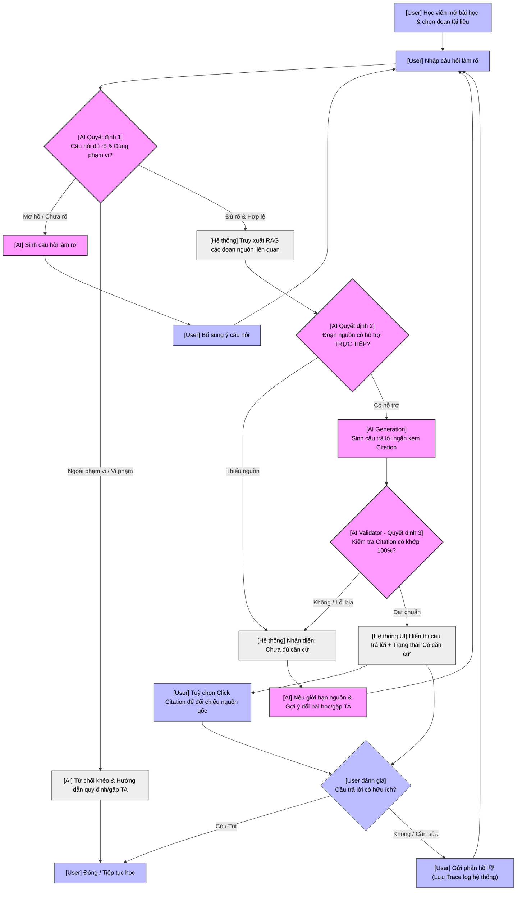

```mermaid
flowchart TD
    A["[User] Học viên mở bài học & chọn đoạn tài liệu"] --> B["[User] Nhập câu hỏi làm rõ"]

    B --> C{"[AI Quyết định 1]<br/>Câu hỏi đủ rõ & Đúng phạm vi?"}

    C -- Mơ hồ / Chưa rõ --> D["[AI] Sinh câu hỏi làm rõ"]
    D --> E["[User] Bổ sung ý câu hỏi"]
    E --> B

    C -- Ngoài phạm vi / Vi phạm --> X["[AI] Từ chối khéo & Hướng dẫn quy định/gặp TA"]
    X --> O

    C -- Đủ rõ & Hợp lệ --> F["[Hệ thống] Truy xuất RAG các đoạn nguồn liên quan"]

    F --> G{"[AI Quyết định 2]<br/>Đoạn nguồn có hỗ trợ TRỰC TIẾP?"}

    G -- Thiếu nguồn --> H["[Hệ thống] Nhận diện: Chưa đủ căn cứ"]
    H --> I["[AI] Nêu giới hạn nguồn & Gợi ý đổi bài học/gặp TA"]
    I --> B

    G -- Có hỗ trợ --> J["[AI Generation]<br/>Sinh câu trả lời ngắn kèm Citation"]

    J --> K{"[AI Validator - Quyết định 3]<br/>Kiểm tra Citation có khớp 100%?"}

    K -- Không / Lỗi bịa --> H
    K -- Đạt chuẩn --> L["[Hệ thống UI] Hiển thị câu trả lời + Trạng thái 'Có căn cứ'"]

    L --> M["[User] Tuỳ chọn Click Citation để đối chiếu nguồn gốc"]
    L --> N{"[User đánh giá]<br/>Câu trả lời có hữu ích?"}
    M --> N

    N -- Có / Tốt --> O["[User] Đóng / Tiếp tục học"]
    N -- Không / Cần sửa --> P["[User] Gửi phản hồi 👎 (Lưu Trace log hệ thống)"]
    P --> B

    %% Styling màu sắc đặt hoàn toàn ở cuối
    classDef aiStyle fill:#f9f,stroke:#333,stroke-width:2px,color:#000;
    classDef userStyle fill:#bbf,stroke:#333,stroke-width:1px,color:#000;
    classDef sysStyle fill:#eee,stroke:#333,stroke-width:1px,color:#000;

    class A,B,E,M,N,O,P userStyle;
    class C,D,G,I,J,K aiStyle;
    class F,H,L,X sysStyle;
```