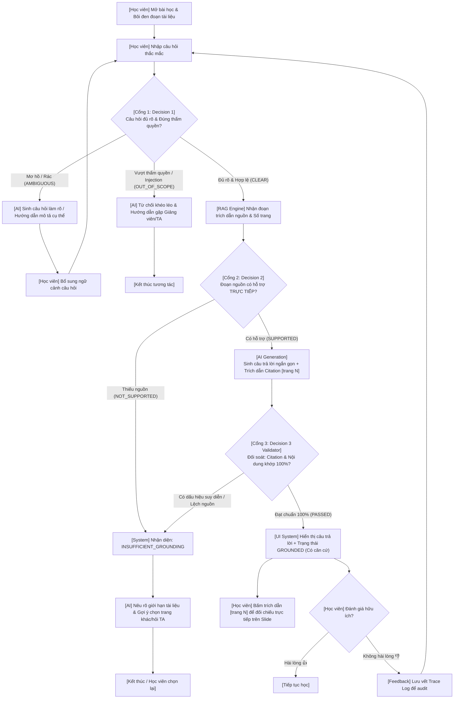

```mermaid
flowchart TD
    A["[Học viên] Mở bài học & Bôi đen đoạn tài liệu"] --> B["[Học viên] Nhập câu hỏi thắc mắc"]

    B --> C{"[Cổng 1: Decision 1]<br/>Câu hỏi đủ rõ & Đúng thẩm quyền?"}

    %% Nhánh Cổng 1
    C -- "Mơ hồ / Rác (AMBIGUOUS)" --> D["[AI] Sinh câu hỏi làm rõ / Hướng dẫn mô tả cụ thể"]
    D --> E["[Học viên] Bổ sung ngữ cảnh câu hỏi"]
    E --> B

    C -- "Vượt thẩm quyền / Injection (OUT_OF_SCOPE)" --> X["[AI] Từ chối khéo léo & Hướng dẫn gặp Giảng viên/TA"]
    X --> FIN1["[Kết thúc tương tác]"]

    %% Qua Cổng 1 -> Cổng 2
    C -- "Đủ rõ & Hợp lệ (CLEAR)" --> F["[RAG Engine] Nhận đoạn trích dẫn nguồn & Số trang"]
    F --> G{"[Cổng 2: Decision 2]<br/>Đoạn nguồn có hỗ trợ TRỰC TIẾP?"}

    %% Nhánh Cổng 2
    G -- "Thiếu nguồn (NOT_SUPPORTED)" --> H["[System] Nhận diện: INSUFFICIENT_GROUNDING"]
    H --> I["[AI] Nêu rõ giới hạn tài liệu & Gợi ý chọn trang khác/hỏi TA"]
    I --> FIN2["[Kết thúc / Học viên chọn lại]"]

    %% Qua Cổng 2 -> Generation
    G -- "Có hỗ trợ (SUPPORTED)" --> J["[AI Generation]<br/>Sinh câu trả lời ngắn gọn + Trích dẫn Citation [trang N]"]

    %% Cổng 3: Validator
    J --> K{"[Cổng 3: Decision 3 Validator]<br/>Đối soát: Citation & Nội dung khớp 100%?"}

    %% Nhánh Cổng 3
    K -- "Có dấu hiệu suy diễn / Lệch nguồn" --> H
    K -- "Đạt chuẩn 100% (PASSED)" --> L["[UI System] Hiển thị câu trả lời + Trạng thái GROUNDED (Có căn cứ)"]

    L --> M["[Học viên] Bấm trích dẫn [trang N] để đối chiếu trực tiếp trên Slide"]
    L --> N{"[Học viên] Đánh giá hữu ích?"}
    N -- "Hài lòng 👍" --> FIN3["[Tiếp tục học]"]
    N -- "Không hài lòng 👎" --> P["[Feedback] Lưu vết Trace Log để audit"]
    P --> B
```